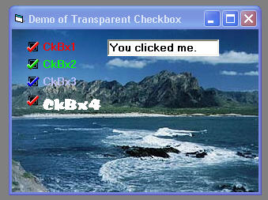



## Checkbox \- \- \-a transparent usercontrol

### Description

Theres been several checkbox controls lately, so I thought I'd try one that was transparent. So here it is. Not to fancy but seems to work. Hope you like it.
 
### More Info
 

             |
---                |---
**Submitted On**   |2005-08-25 15:21:44
**By**             |[Kenneth Foster](https://github.com/Planet-Source-Code/PSCIndex/blob/master/ByAuthor/kenneth-foster.md)
**Level**          |Intermediate
**User Rating**    |4.8 (29 globes from 6 users)
**Compatibility**  |VB 6\.0
**Category**       |[Custom Controls/ Forms/  Menus](https://github.com/Planet-Source-Code/PSCIndex/blob/master/ByCategory/custom-controls-forms-menus__1-4.md)
**World**          |[Visual Basic](https://github.com/Planet-Source-Code/PSCIndex/blob/master/ByWorld/visual-basic.md)
**Archive File**   |[Checkbox\_\-1927308252005\.zip](https://github.com/Planet-Source-Code/kenneth-foster-checkbox-a-transparent-usercontrol__1-62322/archive/master.zip)

